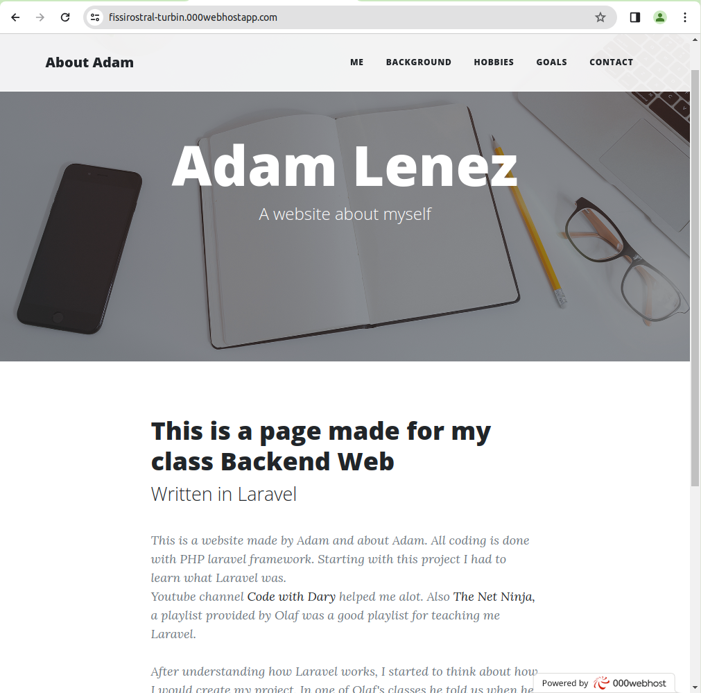
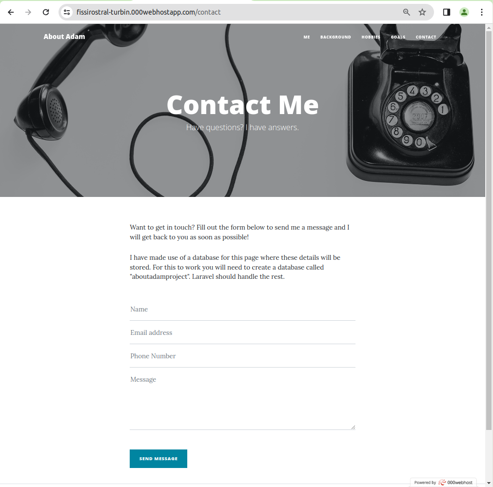
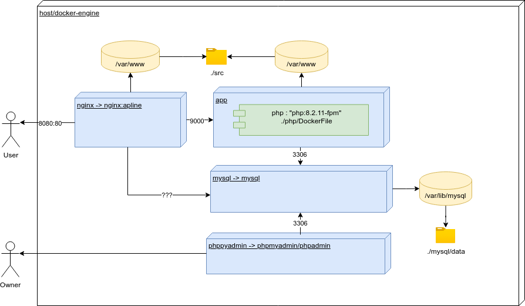
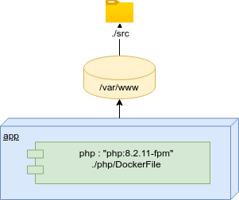
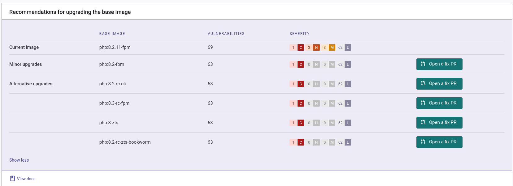
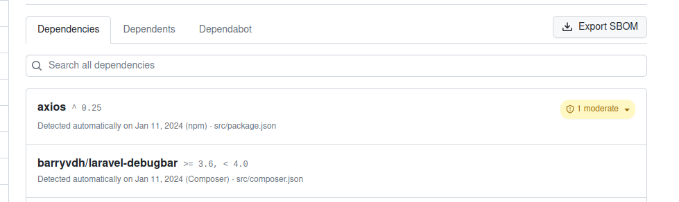
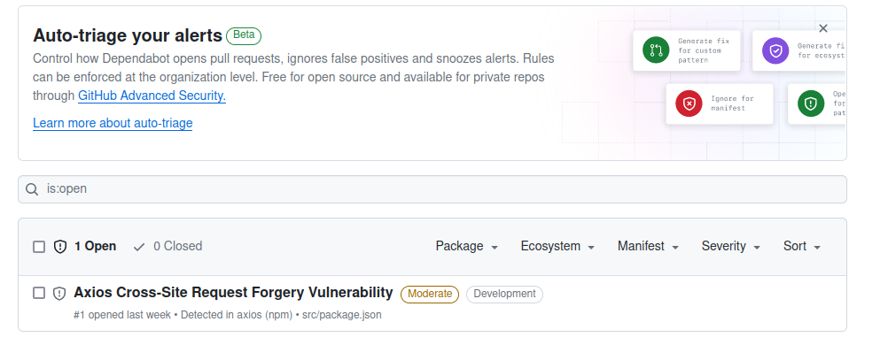

# Review on https://github.com/ehbstudentadam/aboutadamdocker.

This report concerns a review on an application build by my fellow student **Adam Lenez**.
The source code of this application is to be found at github in the public repo https://github.com/ehbstudentadam/aboutadamdocker.  
The application itself is publicly hosted and available at https://fissirostral-turbin.000webhostapp.com/.

## Applicative description

As preparation for this review I describe briefly the application from a functional and technical (+ operational) point of view.  
The goal of this is to be able to refer to these parts further in this document as we start with review.

### Functional setup

The application is a intro/bio on Adam (about, hobbies, studies, goals, ...) written in the context of the course "Backend Web".  

#### Dynamic part: Contact

The application is mostly static in nature but contains the possibility to the visitor in 
leaving behind some comments or messages towards Adam at contact-page (see https://fissirostral-turbin.000webhostapp.com/contact)

### Technical setup

#### Frameworks

* The language used is **PHP**, version **8.3**
* The runtime container (and dependency injection) is **Laravel**-based
* **Eloguent** is being used as a persistence framework 

#### Middleware

* **MySQL** is used for **storing** contact information into a relational database
* **NGNIX** is used as a web server/proxy for the PHP/Laravel-application

#### Docker setup (and docker compose)

The application in github by Adam is docker-based.  
I created a small diagram as an overview of the setup described with the docker-compose.yaml to be found in the root of the source tree.

## Approach of this report

Each review remark contains an identifier.  
These identifiers each are prefixed with the type:

* **PR** for privacy (e.g. PR-01)
* **IF** for infrastructure (e.g. IF-01)
* **SCA** for software component analysis (e.g. SCA-01)
* **SAST** for static code analysis (e.g. SAST-01)
* **DAST** for dynamic code analysis (e.g. DAST-01)

Each proposition for patch or solution is also identified and prefixed with the review identifier.  

e.g. a solution for PR-01 could be PR-01-S1 where the S stands for solution.  
Beside **S** for **solution** we can also use **M** for **mitigation** or **A** for **automation**

## Review

An overview of the remarks, source and possible solutions, mitigations or automations 
are to be found in the remainder of this chapter.  
For a quick overview you can consult the table below:

| ID      | Description                          | Source     | ID         | Solution                                      |
| ------- | ------------------------------------ | ---------- | ---------- | --------------------------------------------- |
| PR01-S1 | GDPR regulations                     | Manual     | PR01-S1    | Privacy notice                                |
|         |                                      |            | PR01-S2    | Contact information                           |
|         |                                      |            | PR01-S3    | Who is processing?                            |
|         |                                      |            | PR01-S4    | Consent                                       |
|         |                                      |            | PR01-S5    | Data-rentention                               |
|         |                                      |            | PR01-S6    | rectification                                 |
| IF01    | Codebase inside volume               | Manual     | IF01-S1    | Include configuration and code in the image   |
| IF02    | Deploying with too many dependencies | Manual     | IF02-S1    | Remove unnecessary dependencies               |
|         |                                      |            | IF02-S2    | Replace dev-libraries                         |
|         |                                      |            | IF02-S3    | Minimalistic approach                         |
| IF-03   | Usage of .env-file inside volume     | Manual     | IF03-S1    | Externalize environment files                 |
| IF-04   | Privelege escalation                 | SEMGREP    | IF-04-S1   | Apply security-opt-configuration              |
| IF-05   | Writable root filesystem             | SEMGREP    | IF-05-S1   | Apply read_only-configuration                 |
| IF-06   | PHPadmin is running                  | Manual     | IF-06-S1   | Create a well secured admin page              |
| SCA-01  | Outdated PHP-image                   | SNYK       | SCA-01-S1  | Minor upgrade to php:8.2-fpm                  |
|         |                                      |            | SCA-01-M1  | Mitigation on CVE-2023-45853                  |
| SCA-02  | Axios outdated                       | DEPENDABOT | SCA-02-S1  | Upgrade Axios to 1.6                          |
|         |                                      |            | SCA-02-A1  | Activate Dependabot                           |
| SAST-01 | Validate input-fields                | Manual     | SAST-01-S1 | Perform validation in the controller or model |
| DAST-01 | Information leaks through .htaccess  | ZAP        | DAST-01-M1 | .htaccess is not being used                   |
|         |                                      |            | DAST-01-S1 | Remove the .htaccess from the code base       |
| DAST-02 | CSP Header is not set                | ZAP,SONAR  | DAST-02-S1 | Add Content-Security-Policy to NGNIX          |
| DAST-03 | Missing Anti-clickjacking Header     | ZAP        | DAST-03-S1 | Add "frame-ancestors 'none'" to NGNIX         |

### Privacy and GDPR

#### (PR01) Contact form need to align to GDPR regulations  (source: manual review)

A visitor is allowed to leave a message by filling out a form so that the owner (Adam in this case) can contact visitors of the site.

The data that the visitor provides is structured by:

* Name
* Email address
* Phone Number
* The actual message

In the context of GDPR the data - which is entered by the visitor - can be considered **personal information**.  
Depending on the nature of the message left behind, the data can also be considered  can also in some cases be considered sensitive data.

From the website it's not transparent:

* How the data is been processed
* For what purposes will it be used
* Retention period for this data?  Will this data being kept in a database forever or will it be removed after some time?
* ...

##### (PR01-S1) Privacy notice

Provide a clearly visible privacy notice (or a link to) and **outline** clearly how the messages and the **data** will be handled.  
Will it be used only for internal use, is it possible that data will be visible in any form to others.

##### (PRO1-S2) Contact information

Provide **contact information** (mail and others) a controller

##### (PRO1-S3) Who is processing?

As (I assume) this application is only used by the owner (Adam in this case) for reading messages.
clearly indicate that this data will be processed directly by the owner/controller and not by other processors

##### (PR01-S4) Consent

Include a **consent checkbox** in the message form that visitors need to check before submitting their message.  
The checkbox should **clearly indicate** that the user **acknowledges** and **agrees** to the terms **outlined** in the **privacy notice**.

##### (PR01-S5) Data-rentention

Provide a **data retention notice**, how long will this message be stored in the database

##### (PR01-S6) Provide the right of access, rectification and erasure of data.  

Provide the right of access, rectification and erasure of data to the data-subjects.
This can be done by building extra software or by describing a clear process to do so.

### Infrastructure (Docker and Docker Compose)

The code is documented to be deployed with Docker (and Docker Compose).  

#### (IF01) Codebase inside a volume (source: manual review)

As described below in the diagram the PHP-code and other source-artefact (html, .env, ...) are running beside the container in a separate volume.

This is pattern that makes it indeed easy for the developer is changing the code without any 
deployments (and without requiring a full installation of PHP and other requirements).

However this is pattern that you should not document as a runtime model.
You're able to access and modify the code once you have access to the server.

##### (IF01-S1) Include configuration and code in the image

In order to avoid using the host's filesystem you could use the COPY-command
to push the code onto the image.

The solution would look like hereunder where you:

* Push the source-code onto the image
* And perform the necessary initializations

~~~Dockerfile
FROM php:8.2.11-fpm

RUN apt-get update && apt-get install -y composer
...
COPY ./src /var/www/
...
RUN app composer install
RUN artisan migrate
RUN artisan key:generate
~~~

#### (IF02) Deploying with too many dependencies (source: manual review)

The current image is deploying way too many dependencies onto the image.  

There is e.g. no need to install editor like nano and vim onto a image that only
hosts a PHP-applciations

~~~Dockerfile
# Install useful tools
RUN apt-get -y install apt-utils nano wget dialog vim
~~~

Neither is there a need to install git and also try to avoid the
use of dev-libraries.

~~~Dockerfile
# Install important libraries
RUN apt-get -y install --fix-missing \
    apt-utils \
    build-essential \
    git \
    curl \
    libcurl4 \
    libcurl4-openssl-dev \
    zlib1g-dev \
    libzip-dev \
    zip \
    libbz2-dev \
    locales \
    libmcrypt-dev \
    libicu-dev \
    libonig-dev \
    libxml2-dev
~~~

##### (IF02-S1) Remove unnecessary dependencies

Remove the dependencies to nano, git, vim, dialog which
are only required for user interaction

##### (IF02-S2) Replace dev-libraries

Replace dev-libraries (e.g. libbz2-dev) by the normal version (e.g. libbz2) and perform
the necessary regression testing. 

##### (IF02-S3) Minimalistic approach

This is a 90% static application, some of the libraries can be removed for making the application run.

#### (IF-03) Usage of .env-file inside volume

As mentioned in IF01 source code should not be stored in a volume.  
The same counts for the .env-file but in that case you would have a problem in adapting
the .env-file to the right environment.

##### (IF03-S1) Externalize environment files

There are 2 alternatives to this.  

The least secure is porting the .env-file to the docker-compose level, this will ensure that these
variables will be exposed to the application as environment-variables.

The better approach however would be to use al solution like Docker secrets

https://docs.docker.com/compose/use-secrets/

More information on how to use these in Laravel can be found at:

* https://www.iwader.co.uk/posts/2017/11/using-docker-secrets-laravel/
* https://packagist.org/packages/corbosman/laravel-docker-secrets

#### (IF-04) Privelege escalation (source: SEMGREP)

Processes running within that container can potentially acquire additional privileges after the initial startup.  
This includes e.g. changing the effect user and group ID's, capabilities, ... as the container is running
as superuser.

##### (IF-04-S1) Apply security-opt-configuration

Add the security-option as shown below into each service

~~~yaml
  ...
  security_opt:
      - no-new-privileges:true
  ...
~~~

#### (IF-05) Writable root filesystem (source: SEMGREP)

All services within the docker compose are running with writable root filesystem. 
This may allow malicious applications to download and run additional payloads, or modify container files. 

##### (IF-05-S1) Apply read_only-configuration

Add the security-option as shown below into each service

~~~yaml
  ...
services:
  ngnix:
    image: ngnix
    read_only: true
  ...
~~~

#### (IF-06) PHPadmin is running (source: MANUAL)

PHPAdmin seems to have a lot of vulnerabilities and is not advised to run in production.  
See e.g. https://medium.com/@959652664/summary-and-analysis-of-penetration-testing-based-on-phpmyadmin-784896851cf9 for some examples.  

##### (IF-06-S1) Implement a page for viewing (and removing) comments

Since you want to see the comments the suggestion is to create a kind of minimalistic but well protected
admin space where you can manage this.

### Software Composition Analysis (SCA)

#### (SCA-01) Outdated PHP-image (source: SNYK)

Running SNYK delivers only vulnerabilities on the Docker base-image (php:8.2.11-fpm) as show below:

The following vulnerabilities are indicated as Critical to Medium severity.

Critical vulnerability:

* https://www.cve.org/CVERecord?id=CVE-2023-45853

High severity:

* https://www.cve.org/CVERecord?id=CVE-2023-44487
* https://www.cve.org/CVERecord?id=CVE-2023-47038
* https://www.cve.org/CVERecord?id=CVE-2023-5363

Medium severity:

* https://www.cve.org/CVERecord?id=CVE-2023-46218
* https://www.cve.org/CVERecord?id=CVE-2023-5981
* https://www.cve.org/CVERecord?id=CVE-2023-46219

##### (SCA-01-S1) Minor upgrade to php:8.2-fpm (patch)

To solve the high and medium errors are to be solved without to much impact.  
You need to replace for this current base-image php:8.2.11-fpm with the latest one php:8.2-fpm

##### (SCA-01-M1) Mitigation on CVE-2023-45853

The critical CVE is very recent and at the time being it's not yet solved.  

The CVE itself applies to the ZLIB-library used for compression, at first sight it doesn't seem to apply to any
code within the Laravel-framework (or it's at least not being used).

For the time being it will be important to keep watching for upgrades on this [CVE](https://www.cve.org/CVERecord?id=CVE-2023-45853)
and to ensure update.

##### (SCA-01-A1) Activate automatic patching (automation)

An optional feature - as the application is not huge in scale - is to use
use SNYK for automatic scans, warnings and updates (as DEPENDABOT is not picking this up)

#### (SCA-02) Axios outdated (source: DEPENDABOT)

Dependabot (Github) is point to a moderate vulnerability in Axios

See https://github.com/advisories/GHSA-wf5p-g6vw-rhxx  for more information

##### (SCA-02-S1) Upgrade Axios to 1.6

In order to solve this issue you should upgrade Axios in package.json

##### (SCA-02-A1) Activate Dependabot

Activate Dependabot so that it can create systematically push-requests.

### Static Code Analysis

#### (SAST-01) Validate input-fields (manual review)

No validation on the size of the messages is provided in the contact-form.  
This could lead to a **Denial Of Service** by sending messages of 1.5 MB (above that the ngnix will send a 413 issue.)

##### SAST-01-S1 Perform validation in the controller or model

Check server-side for a validation on a reasonable size of the message (and other fields).  

### Dynamic Code Analysis

The main part of the DAST has been performed with ZAP.  
An export of the ZAP-report can be found in the [ZAP-report](./zap/ZAP-Report-.html)

#### (DAST-01) Information leaks through .htaccess (ZAP, manual)

ZAP discovered that an .htaccess can be accessed through http://localhost:8080/.htaccess.  
This can potentially leak information or compromise the webserver.

##### (DAST-01-M1) .htaccess is not being used

Using ngnix the .htaccess is not being used and not sensible information is being shared in this file (after manual review)

##### (DAST-01-S1) Remove the .htaccess from the code base

As it's better to prevent in case the application could be deployed in the future on an Apache Web Server it's better to remove.

#### (DAST-02) CSP Header is not set (ZAP)

> Note: description is copied as described by ZAP as I couldn't describe it better myself

Content Security Policy (CSP) is an added layer of security that helps to detect and mitigate certain types of attacks, including Cross Site Scripting (XSS) and data injection attacks. These attacks are used for everything from data theft to site defacement or distribution of malware.   
CSP provides a set of standard HTTP headers that allow website owners to declare approved sources of content that browsers should be allowed to load on that page — covered types are JavaScript, CSS, HTML frames, fonts, images and embeddable objects such as Java applets, ActiveX, audio and video files.

##### (DAST-02-S1) Add Content-Security-Policy to the NGNIX-configuration 

In order to perform to many boilerplate-code in the laravel-code the best and simples option 
would be to alter the ngnix-configuration.  
Below you'll fine an example-snippet

~~~nginx
add_header Content-Security-Policy "default-src 'self';";
~~~

#### (DAST-03) Missing Anti-clickjacking Header

The response does not include either Content-Security-Policy with 'frame-ancestors' 
directive or X-Frame-Options to protect against 'ClickJacking' attacks.

##### (DAST-03-S1) Add "frame-ancestors 'none'" to the NGNIX-configuration 

Below you'll fine an example-snippet

~~~nginx
add_header Content-Security-Policy "frame-ancestors 'none'";
add_header X-Frame-Options DENY;
~~~

See also https://probely.com/vulnerabilities/missing-clickjacking-protection#:~:text=To%20configure%20nginx%20to%20send%20the%20X%2DFrame%2DOptions%20header,framing%2C%20typically%20from%20other%20domains for more information.
